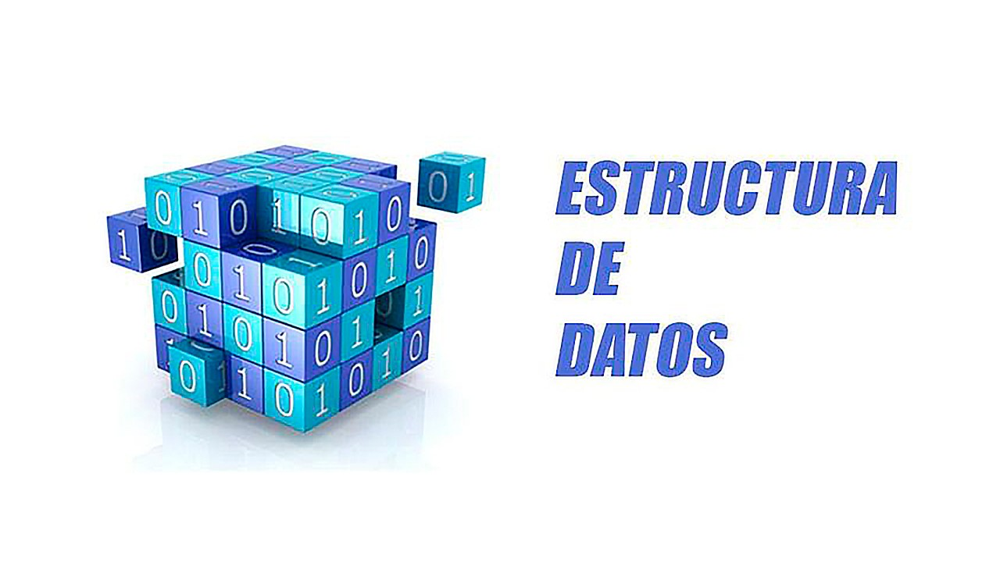

# Estructura de Datos

En este `repositorio` podras encontrar trmas
relacionados con `estructura de datos` implementadas
en **Java** como:

1. Tipos de datos abstractos
2. Recursividad
3. Arreglos
4. Genericos
5. Listas
6. Pilas
7. Colas
8. Metodos de ordenaniento y busqueda
9. Arboles

